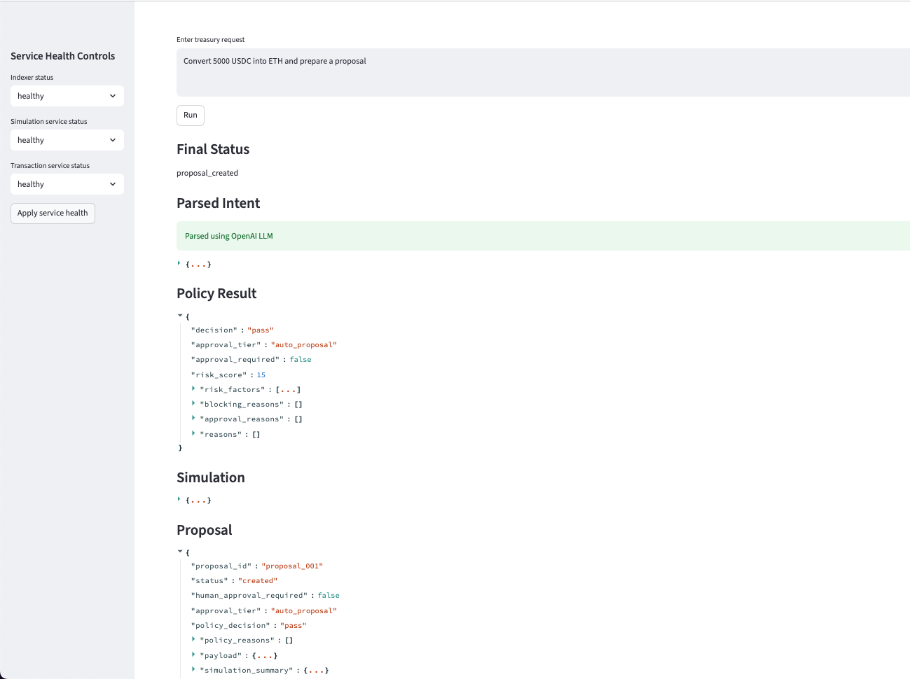
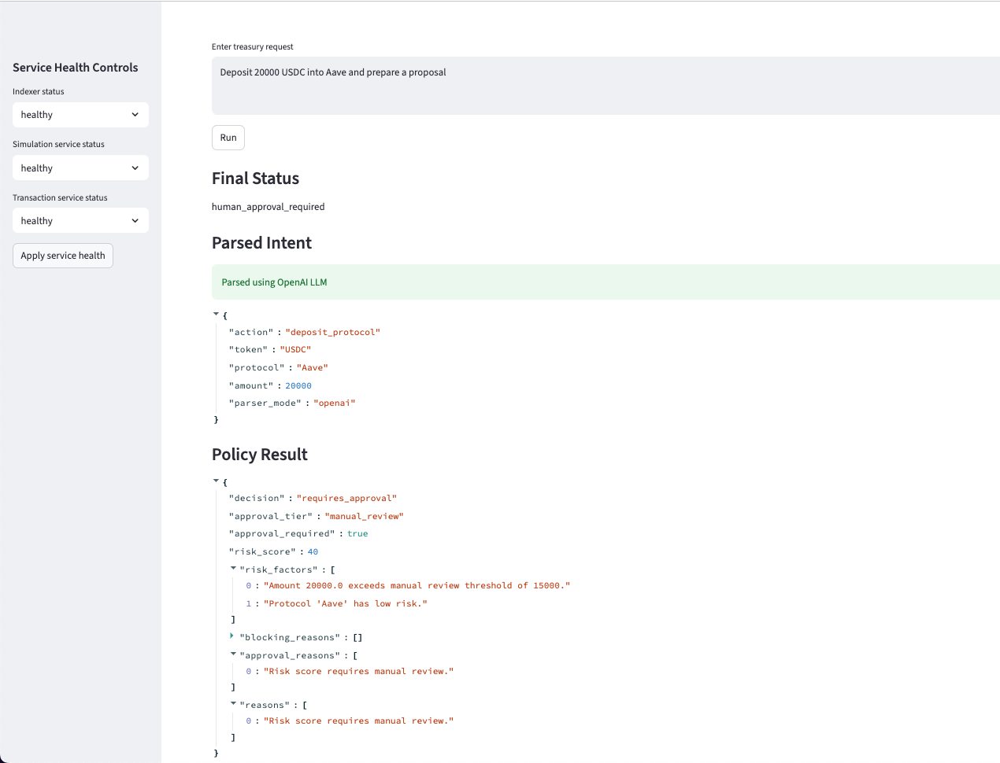
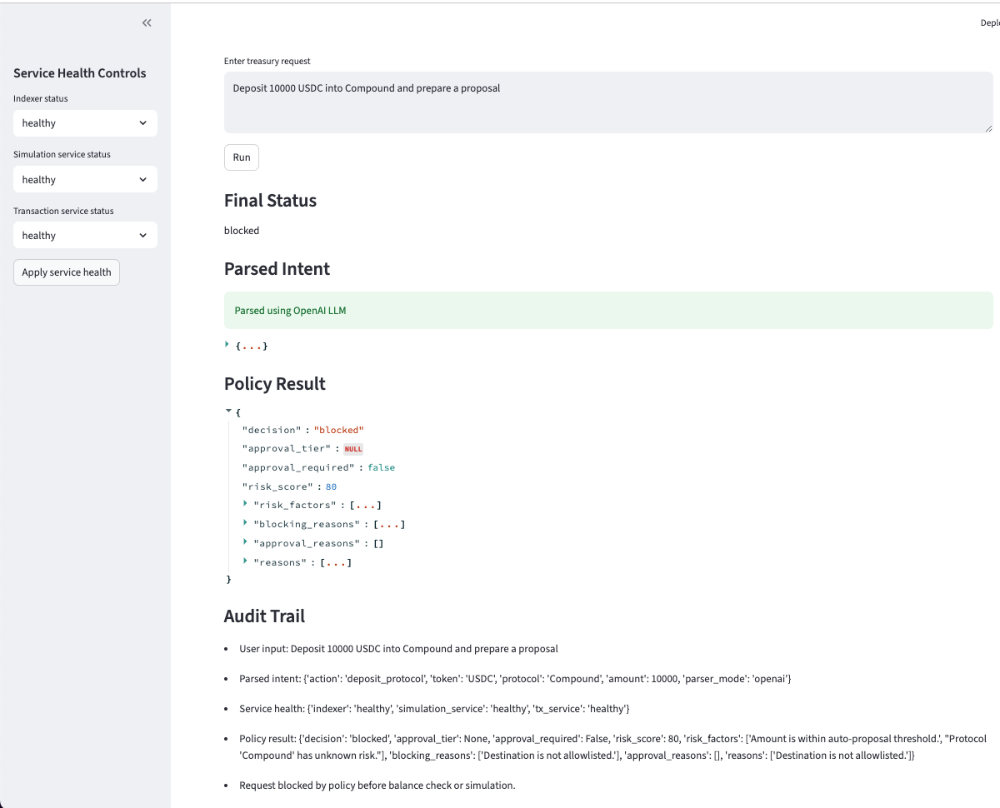

# Safe Treasury Copilot

## Overview

Safe Treasury Copilot is an AI-assisted treasury proposal system that converts natural-language treasury requests into structured proposals, validates them against deterministic policy rules, simulates expected outcomes, and routes requests into approval tiers based on risk.

The system intentionally creates proposals only. It does not execute transactions.

## Problem

Treasury teams often need to evaluate requests such as swaps, protocol deposits, and wallet transfers. These workflows require speed, but they also require strong controls because mistakes can lead to financial loss, compliance issues, or operational risk.

Natural-language interfaces can make treasury operations easier to initiate, but they introduce risk if an LLM is allowed to make policy or execution decisions.

## Target User

This project is designed around a treasury operator or finance/operations team member who needs to prepare treasury actions for review.

## Solution

Safe Treasury Copilot separates probabilistic and deterministic responsibilities:

- The LLM parses user intent.
- The policy engine enforces deterministic rules.
- The service layer checks balances, service health, and simulated outcomes.
- The proposal generator creates an auditable proposal for human review.

## Key Workflows

| User request | Expected outcome | Why |
|---|---|---|
| Convert 5000 USDC into ETH and prepare a proposal | Proposal created | Low-risk swap with sufficient balance |
| Deposit 20000 USDC into Aave and prepare a proposal | Human approval required | Amount exceeds review threshold |
| Deposit 10000 USDC into Compound and prepare a proposal | Blocked | Protocol is not allowlisted |
| Move some treasury funds into a safer asset | Clarification needed | Request is ambiguous |

## Architecture

```text
Streamlit UI
   ↓
Orchestrator
   ↓
Intent Parser
   ├── OpenAI parser
   └── Local fallback parser
   ↓
Policy Engine
   ↓
Risk Model
   ↓
Services
   ├── Balance service
   ├── Simulation service
   └── Service health service
   ↓
Proposal Generator
   ↓
Audit Trail
```

## Safety Model

The core safety principle is:

> The LLM interprets intent, but deterministic systems enforce policy.

The system does not allow the LLM to decide whether a transaction is safe, approved, or executable.

## Risk-Based Approval Logic

Safe Treasury Copilot uses a simple, explainable risk model.

Risk factors include:

- action type
- amount
- destination or protocol risk
- allowlist status

The policy engine maps the risk result into one of three outcomes:

| Decision | Meaning |
|---|---|
| `pass` | Proposal can be created without additional approval |
| `requires_approval` | Proposal can be created, but requires human approval |
| `blocked` | Proposal should not be created |

## Example Outputs

The repository includes example outputs generated from the orchestrator.

| Scenario | Example output | What it demonstrates |
|---|---|---|
| Low-risk swap | [`examples/low_risk_swap_proposal.json`](examples/low_risk_swap_proposal.json) | Proposal creation for a low-risk treasury action |
| Manual-review deposit | [`examples/manual_review_deposit_proposal.json`](examples/manual_review_deposit_proposal.json) | Risk-based approval escalation |
| Blocked protocol deposit | [`examples/blocked_protocol_result.json`](examples/blocked_protocol_result.json) | Deterministic policy enforcement before simulation |
| Ambiguous request | [`examples/clarification_needed_result.json`](examples/clarification_needed_result.json) | Clarification instead of unsafe guessing |

## Screenshots

### Low-risk swap: proposal created

This flow shows a low-risk swap that passes policy checks and creates a proposal.



Full JSON output: [`examples/low_risk_swap_proposal.json`](examples/low_risk_swap_proposal.json)

### Manual-review deposit: approval required

This flow shows an allowlisted protocol deposit that exceeds the manual review threshold and is routed for human approval.



Full JSON output: [`examples/manual_review_deposit_proposal.json`](examples/manual_review_deposit_proposal.json)

### Blocked protocol deposit: policy short-circuit

This flow shows a non-allowlisted protocol being blocked before balance checks or simulation.



Full JSON output: [`examples/blocked_protocol_result.json`](examples/blocked_protocol_result.json)


## Service Degradation Handling

The prototype includes service health controls for:

- indexer
- simulation service
- transaction service

If the simulation service is degraded, the system blocks proposal creation because it cannot safely simulate the requested action.

If the indexer is degraded, the system warns that balances may be stale.

## Trade-offs

This prototype intentionally uses synthetic data rather than real treasury accounts or wallet integrations.

Key trade-offs:

- Synthetic data improves safety and reproducibility, but limits realism.
- Streamlit enables fast iteration, but is not production-grade UI infrastructure.
- The risk model is intentionally simple and explainable rather than complex or falsely precise.
- The system creates proposals only, avoiding the risks of automated execution.

## How to Run Locally

1. Clone the repository.

```bash
git clone <your-repo-url>
cd safe-treasury-copilot
```

2. Create a virtual environment.

```bash
python3 -m venv .venv
source .venv/bin/activate
```

3. Install dependencies.

```bash
pip install -r requirements.txt
```

4. Create a `.env` file.

```bash
cp .env.example .env
```

Add your OpenAI API key:

```text
OPENAI_API_KEY=your_api_key_here
```

5. Run the app.

```bash
streamlit run app.py
```

## Future Improvements

Potential extensions:

- richer approval tiers
- per-chain policy configuration
- gas fee simulation
- more realistic service failure modes
- reviewer comments and approval workflow
- persistent proposal history
- lightweight automated tests for policy and risk logic